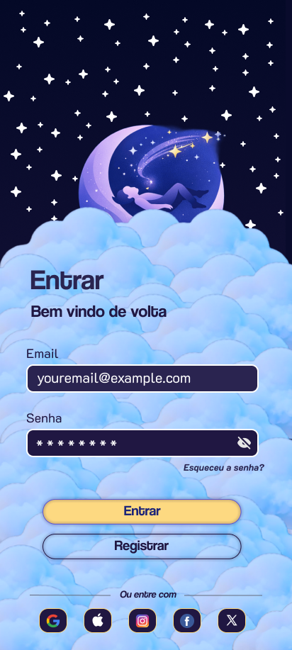
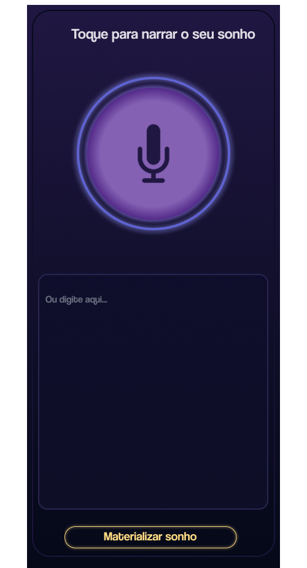

## Virtual Dream 🌙
<div align="center">
  
</div>
<br/>

[](https://kotlinlang.org/)
[](https://developer.android.com/jetpack/compose)
[](https://developer.android.com/)
[](https://developer.android.com/)

---

# O que é o Virtual Dream? ✧˖°
**Virtual Dream** é um aplicativo Android que interpreta seus sonhos usando inteligência artificial. Descreva o que você sonhou e receba uma análise profunda, simbólica e personalizada — símbolos, emoções e padrões oníricos decifrados para revelar o que sua mente processa enquanto você dorme.

> *"Os sonhos são sussurros do subconsciente — Virtual Dream te ajuda a escutá-los."*
---

# Funcionalidades ⭒₊ ⊹🌕₊ ⊹⭒
<div align="center">

| &nbsp;&nbsp;✦&nbsp;&nbsp; | Recurso | Descrição |
|:---:|:---|:---|
| 🔮 | **Interpretação com IA** | Análise simbólica e psicológica gerada em tempo real |
| 📖 | **Diário de Sonhos** | Registre e acompanhe seus sonhos ao longo do tempo |
| 🌙 | **Padrões Oníricos** | Descubra temas e símbolos recorrentes nos seus sonhos |
| 🎨 | **UI Imersiva** | Interface construída com Jetpack Compose |
| ☁️ | **Histórico em Nuvem** | Sonhos salvos e acessíveis de qualquer lugar |

</div> 

---

## Telas / Fluxo - ˗ˏˋ ★ ˎˊ˗

<div align="center">
<table>
  <tr>
    <td align="center"><b>🏠 Início</b></td>
    <td align="center"><b>✍️ Novo Sonho</b></td>
    <td align="center"><b>🔮 Interpretação</b></td>
  </tr>
  <tr>
    <td></td>
    <td></td>
    <td></td>
  </tr>
</table>
</div>

---

### Instalação

```bash
# 1. Clone o repositório
git clone https://github.com/seu-usuario/virtual-dream.git

# 2. Entre na pasta
cd virtual-dream

# 3. Configure sua chave de API no local.properties
echo "API_KEY=sua_chave_aqui" >> local.properties

# 4. Abra no Android Studio e rode ▶️
```

---

#Colaboradores 

<div align="center">
<table>
  <tr>
    <td align="center">
      <a href="https://github.com/eduardobsferreira.png">
        <br/>
        <sub><b>Eduardo Barros </b></sub><br/>
        <sub>🔮 UI/UX | Front End </sub>
      </a>
    </td>
    <td align="center">
      <a href="https://github.com/usuario2">
        <br/>
        <sub><b>Julia Costa</b></sub><br/>
        <sub>🎨 UI/UX Designer</sub>
      </a>
    </td>
    <td align="center">
      <a href="https://github.com/usuario3">
        <br/>
        <sub><b>Mayara Ellen</b></sub><br/>
        <sub>🛸 Marketing </sub>
      </a>
    </td>
    <td align="center">
      <a href="https://github.com/usuario4">
        <br/>
        <sub><b>Nome Completo 4</b></sub><br/>
        <sub>🌙 Back End </sub>
      </a>
    </td>
  </tr>
  <tr>
    <td align="center">
      <a href="https://github.com/usuario5">
        <br/>
        <sub><b>Richard Kayan</b></sub><br/>
        <sub>☁️ Back End </sub>
      </a>
    </td>
    <td align="center">
      <a href="https://github.com/usuario6">
        <br/>
        <sub><b>Cauan Morária</b></sub><br/>
        <sub>🔍 QA & Testes</sub>
      </a>
    </td>
    <td align="center">
      <a href="https://github.com/usuario7">
        <br/>
        <sub><b>Victor Wilker</b></sub><br/>
        <sub>📖 Tech Writer</sub>
      </a>
    </td>
    <td align="center">
      <a href="https://github.com/usuario8">
        <br/>
        <sub><b>Nome Completo 8</b></sub><br/>
        <sub>✨ Product Manager</sub>
      </a>
    </td>
  </tr>
</table>


